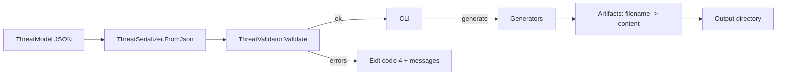
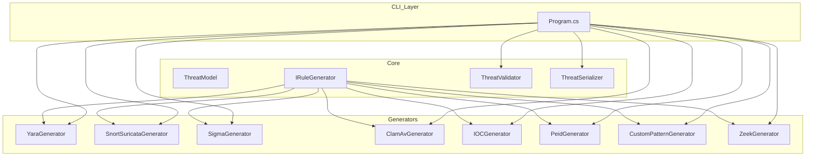

# CrossSigEngine

Modular, extensible malware signature generator for multiple families: YARA, Snort/Suricata, Sigma, ClamAV, IOC lists, PEiD-like, Custom pattern JSON, and Zeek.

## Quick start

1. Build the solution.
2. Generate signatures from the sample threat JSON.

### One-command smoke test (PowerShell)

Run a quick end-to-end smoke test that starts the Web app, checks health, and exercises key APIs:

```powershell
./scripts/smoke.ps1
```

Options:

- Port: `./scripts/smoke.ps1 -Port 5055`
- Skip build: `./scripts/smoke.ps1 -SkipBuild`

### Build

```powershell
dotnet build
```

### Generate from sample

```powershell
dotnet run --project .\CrossSigEngine.Cli -- generate --family all --in .\samples\threats\cobaltstrike.json --out .\out
```

Artifacts are written to `out/` (e.g., `.yara`, `.rules`, `.yml`, `.ndb/.hdb`, `.iocs.*`, `.peid.json`, `.patterns.json`, `.zeek`).

### Docker Compose (Web + Webhook)

Bring up the Web UI on 8080 and a local webhook receiver on 9090:

```powershell
docker compose up --build
```

Open:

- Web UI: <http://localhost:8080>
- Health: <http://localhost:8080/healthz>
- Webhook: <http://localhost:9090/>

In the Web UI Directory Scan tab, set Webhook URL to `http://host.docker.internal:9090/`.

## Samples

Sample threat models live in `samples/threats/`:

- `cobaltstrike.json`
- `emotet.json`
- `trickbot.json`
- `agenttesla.json`
- `phishingkit.json`

Generate all families from a sample:

```powershell
dotnet run --project .\CrossSigEngine.Cli -- generate --family all --in .\samples\threats\emotet.json --out .\out
```

Validate a sample:

```powershell
dotnet run --project .\CrossSigEngine.Cli -- validate --in .\samples\threats\trickbot.json
```

### Validate a threat model

Static checks to catch obvious problems before generation:

```powershell
dotnet run --project .\CrossSigEngine.Cli -- validate --in .\samples\threats\cobaltstrike.json
```

Exit codes:

- 0: success (generation completed, or validation had no errors; warnings may still be printed)
- 1: usage error (missing arguments)
- 2: input file not found
- 3: unknown family
- 4: validation errors found
- 5: scan found matches when `--fail-on-match` is set

### Scan files or directories

Use the built-in scanner to search strings, hex patterns, and file hashes:

```powershell
dotnet run --project .\CrossSigEngine.Cli -- scan --in .\samples\threats\cobaltstrike.json --path C:\targets --recursive --parallel 4 --out .\out\alerts.jsonl
```

Notes:

- The scanner respects the ThreatModel’s `file.strings`, `file.hex_patterns`, and `file.hashes`.
- Output is JSONL if `--out` is provided; otherwise matches print to the console.
- Use `--parallel <N>` to scan directories concurrently.
- Exclude files with one or more `--exclude` glob patterns (e.g., `--exclude *.iso --exclude *.zip`).
- Skip large files with `--max-file-size <bytes>`.

Alert sinks (optional):

- Webhook (HTTP POST per detection)
  
  ```powershell
  # Generic JSON webhook (with header)
  dotnet run --project .\CrossSigEngine.Cli -- scan --in .\samples\threats\cobaltstrike.json --path C:\targets --webhook https://example.com/alerts \ 
    --webhook-header "Authorization: Bearer <token>" --webhook-delay-ms 100

  # Slack incoming webhook (text-only)
  dotnet run --project .\CrossSigEngine.Cli -- scan --in .\samples\threats\cobaltstrike.json --path C:\targets --webhook https://hooks.slack.com/services/XXX/YYY/ZZZ \ 
    --webhook-format slack
  ```
  
  The JSON payload contains `ruleName`, `family`, `source`, `timestamp`, and the `event` (filePath, indicatorType, indicator, offset).
  For Slack format, a simple `{ text: "..." }` body is sent.

#### Test webhooks (free options)

You can test alerts without credentials using these services:

- RequestCatcher (no signup)
  - Create an endpoint at <https://requestcatcher.com> (choose a unique subdomain)
  - Example:

    ```powershell
    dotnet run --project .\CrossSigEngine.Cli -- scan --in .\samples\threats\phishingkit.json --path .\out --webhook https://yourname.requestcatcher.com
    ```

- Pipedream RequestBin (free account)
  - Create a bin at <https://requestbin.com> and copy the URL
  - Example:

    ```powershell
    dotnet run --project .\CrossSigEngine.Cli -- scan --in .\samples\threats\agenttesla.json --path C:\targets --webhook https://eoxxxxx.m.pipedream.net
    ```

- Beeceptor (free tier)
  - Create endpoint at <https://beeceptor.com>
  - Example:

    ```powershell
    dotnet run --project .\CrossSigEngine.Cli -- scan --in .\samples\threats\emotet.json --path C:\targets --webhook https://adnane-arharbi.free.beeceptor.com/
    ```

- Mockbin (by Kong)
  - Create a bin at <https://mockbin.org> and use its URL
  - Example:

    ```powershell
    dotnet run --project .\CrossSigEngine.Cli -- scan --in .\samples\threats\trickbot.json --path C:\targets --webhook https://mockbin.org/bin/<bin-id>
    ```

Notes:

- Add headers when needed with `--webhook-header "Authorization: Bearer <token>"`.
- Use `--webhook-format slack` for Slack Incoming Webhooks.
- Consider `--webhook-delay-ms 100` to throttle bursts.
- These services are public by default—avoid sending sensitive data.

#### Free webhook testing

If you need a free endpoint to test alerts:

- RequestCatcher (no signup): <https://requestcatcher.com>
  - Create a name (e.g., `yourname`). Your URL becomes `https://yourname.requestcatcher.com`.
  - Example:
  
    ```powershell
    dotnet run --project .\CrossSigEngine.Cli -- scan --in .\samples\threats\phishingkit.json --path .\out --webhook https://yourname.requestcatcher.com --webhook-delay-ms 50
    ```

- Pipedream RequestBin (free signup): <https://requestbin.com>
- Beeceptor (free tier): <https://beeceptor.com>
- Mockbin: <https://mockbin.org>

Tip: These services are for testing—don’t send secrets. Use `--webhook-header` for auth where applicable.

#### End‑to‑end example (phishing sample)

1. Ensure the demo file exists (we include `out/demo_phish.html` containing “Secure Login”).
1. Run the scan and post to your RequestCatcher URL:

   ```powershell
   dotnet run --project .\CrossSigEngine.Cli -- scan --in .\samples\threats\phishingkit.json --path .\out --webhook https://yourname.requestcatcher.com --webhook-delay-ms 50
   ```

1. Open your RequestCatcher page to view the incoming JSON alert(s).

- Windows Event Log (Windows only; may require admin to create source once)

  ```powershell
  dotnet run --project .\CrossSigEngine.Cli -- scan --in .\samples\threats\cobaltstrike.json --path C:\targets --eventlog CrossSigEngine
  ```

#### Local webhook server (dev)

Run a local HTTP listener to receive alerts without external services:

```powershell
dotnet run --project .\CrossSigEngine.Cli -- serve-webhook --port 8080 --path /
```

Then point the scanner at it:

```powershell
dotnet run --project .\CrossSigEngine.Cli -- scan --in .\samples\threats\emotet.json --path C:\targets --webhook http://localhost:8080/
```

Tips:

- On Windows, you may need to run as Administrator or add a URLACL:

  ```powershell
  netsh http add urlacl url=http://localhost:8080/ user=$env:USERNAME
  ```
  
- Use `--out webhook.jsonl` with `serve-webhook` to log requests on disk.

#### PE feature scanning (optional)

If your model includes `file.pe_features`, the scanner can check basic PE traits using the PeNet library (packaged via NuGet):

- Architecture: `pe32`, `pe32+`
- Imports: `import:KERNEL32.dll!CreateFileA` (substring match supported)
- Sections: `section:.text`, `section:.rsrc`

Example threat JSON snippet:

```json
{
  "file": {
    "pe_features": ["pe32+", "import:KERNEL32.dll!VirtualAlloc", "section:.text"]
  }
}
```

## Web app (UI + APIs)

Run the browser-based UI to validate models, generate rules, and scan files/directories without using the CLI:

```powershell
dotnet run --project .\CrossSigEngine.Web
```

Then open the UI at:

- UI: <http://localhost:5000>
- Swagger (API explorer): <http://localhost:5000/swagger>

The page has five tabs:

- Validate: paste your ThreatModel JSON and get validation results.
- Generate: choose a family (or "all") and generate artifacts as filename → content.
- Scan (upload): upload a single file and scan using the model.
- Directory Scan: scan a folder on the server machine with advanced options.
- Sandbox: submit a file or URL to VirusTotal (free API) or a self-hosted Cuckoo instance and view analysis summary and raw JSON.

Directory Scan options map to CLI flags:

- Path: target directory (CLI: `--path`)
- Recursive: include subfolders (CLI: `--recursive`)
- Parallel: degree of concurrency (CLI: `--parallel <N>`)
- Exclude globs: comma-separated patterns (CLI: one or more `--exclude`)
- Max file size (bytes): skip large files (CLI: `--max-file-size <bytes>`)
- Fail on match: HTTP 409 if any detections (CLI: `--fail-on-match`)
- Webhook: URL, headers, format json|slack, delay ms (CLI: `--webhook`, `--webhook-header`, `--webhook-format`, `--webhook-delay-ms`)
- Windows Event Log source: write alerts to Event Log (CLI: `--eventlog <source>`, Windows only)

Tip: you still need to provide a ThreatModel JSON in the text area. A minimal example:

```json
{
  "name": "Sample",
  "file": { "strings": ["abc"], "hex_patterns": ["61 62 63"] }
}
```

Troubleshooting:

- If port 5000 is busy, set a custom URL: `setx ASPNETCORE_URLS http://localhost:5050` (new terminals) or run with `--urls http://localhost:5050`.
- To test webhooks locally, use the built-in server: `dotnet run --project .\CrossSigEngine.Cli -- serve-webhook --port 8080 --path /` and set the Webhook URL to `http://localhost:8080/`.

## Sandbox (VirusTotal or Cuckoo)

Analyze a file or URL with VirusTotal's public API, or with a self-hosted Cuckoo Sandbox. For VirusTotal, provide an API key with `--api-key` or via the `VT_API_KEY` environment variable. For Cuckoo, provide the base API URL (e.g., `http://localhost:8090/api/`).

CLI (VirusTotal):

```powershell
# Set API key once for future terminals
setx VT_API_KEY "<your-virustotal-api-key>"
# Or only for this session:
$env:VT_API_KEY = "<your-virustotal-api-key>"

# Analyze a file
dotnet run --project .\CrossSigEngine.Cli -- sandbox --provider vt --file .\samples\files\test.bin

# Analyze a URL and write JSON result
dotnet run --project .\CrossSigEngine.Cli -- sandbox --provider vt --url https://example.com/payload --out .\out\sandbox.json

# Or pass the key explicitly
dotnet run --project .\CrossSigEngine.Cli -- sandbox --provider vt --file C:\path\to\sample.exe --api-key "<key>"
```

CLI (Cuckoo):

```powershell
# Analyze a file with Cuckoo at http://localhost:8090/api/
dotnet run --project .\CrossSigEngine.Cli -- sandbox --provider cuckoo --base-url http://localhost:8090/api/ --file .\samples\files\test.bin

# Analyze a URL and write JSON to out file
dotnet run --project .\CrossSigEngine.Cli -- sandbox --provider cuckoo --base-url http://localhost:8090/api/ --url https://example.com/payload --out .\out\cuckoo.json
```

Web UI:

- Open the Sandbox tab
- Choose provider (VirusTotal or Cuckoo)
- For VirusTotal: Enter your API key (or set `VT_API_KEY` in the web process environment)
- For Cuckoo: Set Base URL (e.g., `http://localhost:8090/api/`)
- Choose a file or input a URL and submit
- View status, a quick score/summary, and the raw JSON (copyable)

Notes:

- VirusTotal free tier is rate limited; results may take a few seconds.
- Do not upload sensitive data to third-party services.

## Threats database (SQLite)

The Web app persists validated ThreatModels in a lightweight SQLite database to make searching and reusing models easy.

- Storage: a file `cse.sqlite` is created next to the web executable on first run
- Seeding: on startup, if the DB is empty, all JSON files under `samples/threats/` are validated and imported
- Shape: each record stores `Id`, `Name`, optional `Family`, and the original JSON content (kept verbatim)

### Use it from the Web UI

- Open the Threats tab
- Use query, family, and tag filters; pagination is supported
- Click “View” to inspect the raw JSON; copy or download as needed

### API endpoints (via Swagger or HTTP)

- GET `/api/threats?page=1&pageSize=20&q=<text>&family=<exact>&tag=<text>`
  - Full‑text contains search across `Name`, `Family`, and raw JSON for quick filtering
- GET `/api/threats/{id}` → returns a single record
- POST `/api/threats` (body: ThreatModel JSON)
  - The model is validated; HTTP 400 is returned for validation errors
  - On success returns `201 Created` with the stored entity
- DELETE `/api/threats/{id}` → removes a record

Notes:

- Tag filtering is implemented as a simple JSON substring search to keep the initial version fast; future iterations can index tags/fields explicitly
- Because the raw JSON is preserved, you can round‑trip a model from the DB back into the generators or scanner without loss

## Structure

- `CrossSigEngine.Core` — domain models, schema, serialization, validation
- `CrossSigEngine.Generators.Yara` — YARA generator implementation
- `CrossSigEngine.Generators.SnortSuricata` — Snort/Suricata `.rules`
- `CrossSigEngine.Generators.Sigma` — Sigma YAML
- `CrossSigEngine.Generators.ClamAV` — ClamAV `.ndb`/`.hdb`
- `CrossSigEngine.Generators.IOC` — IOC lists (`.txt`/`.csv`)
- `CrossSigEngine.Generators.PEiD` — packer/PE features JSON
- `CrossSigEngine.Generators.CustomPattern` — custom scanner patterns
- `CrossSigEngine.Generators.Zeek` — Zeek policy
- `CrossSigEngine.Cli` — CLI for generation and validation
- `CrossSigEngine.Tests` — unit tests

## Architecture

High level flow:

1. Input: A `ThreatModel` JSON file describes indicators (hashes, strings, hex patterns, domains/URIs, Windows logs, etc.).
2. Deserialize: `ThreatSerializer.FromJson` loads it into `CrossSigEngine.Core.Models.ThreatModel`.
3. Validate: `ThreatValidator.Validate` performs static checks (format and basic quality). The CLI `validate` verb exposes this.
4. Generate: One or more generator plugins implement `IRuleGenerator` and render artifacts for their family.
5. Output: The CLI writes each artifact (filename → content) to the chosen output directory.

Key interfaces and contracts:

- `IRuleGenerator` (in `CrossSigEngine.Core.Generators`):
  - `string Family { get; }`
  - `IReadOnlyDictionary<string,string> Generate(ThreatModel threat)`
  - Each generator returns a map of artifact filename → file content; the CLI persists them.

CLI orchestration (`CrossSigEngine.Cli/Program.cs`):

- `generate --family <yara|snort|suricata|sigma|clamav|ioc|peid|custom|zeek|all> --in <file> --out <dir>`
  - Loads model → optionally you can run `validate` beforehand → selects generators → writes outputs.
- `validate --in <file>`
  - Prints WARN/ERROR findings; exits non‑zero on errors.

Extensibility (add a new family):

- Create a new class library `CrossSigEngine.Generators.<Family>` referencing `CrossSigEngine.Core`.
- Implement `IRuleGenerator` and produce artifacts.
- Add a branch in the CLI family switch to include your generator (and in `all`).
- Add unit tests in `CrossSigEngine.Tests`.

### Diagrams

Flow overview:



Components and dependencies:



## Notes

- The validator performs format and quality checks (hash shape, strings length, hex tokens, domains/URIs, ports, confidence range). It does not run external linters.
- Generators apply basic policy gates to reduce noisy rules; tune as needed.

## Webhook testing

Use a free webhook catcher to test alert delivery without deploying infrastructure:

- RequestCatcher (no signup)
  - <https://requestcatcher.com>
  - Create a unique subdomain (e.g., `yourname`), then use `https://yourname.requestcatcher.com` as the webhook URL.
  - Example:
    
    ```powershell
    dotnet run --project .\CrossSigEngine.Cli -- scan --in .\samples\threats\phishingkit.json --path .\out --webhook https://yourname.requestcatcher.com --webhook-delay-ms 50
    ```
    

- Beeceptor (free tier)
  - <https://beeceptor.com>
  - Create an endpoint like <https://adnane-arharbi.free.beeceptor.com/> (or your own) and use it as the webhook URL.

- Pipedream RequestBin (free with signup)
  - <https://requestbin.com>
  - Create a bin and use the generated URL.

Headers and formats:

- Add auth headers:
  
  ```powershell
  --webhook-header "Authorization: Bearer <token>"
  ```
  
- Slack format:
  
  ```powershell
  --webhook-format slack
  ```
  

## Production hardening

The web app includes:

- Centralized exception handling returning JSON
- CORS enabled (wide-open by default; tighten for prod)
- Liveness and version endpoints:
  - GET `/healthz` → `{ status: "ok" }`
  - GET `/version` → `{ version: "x.y.z.w" }`

Recommended next steps for production:

- Restrict CORS to specific origins
- Configure structured logging and log retention
- Front with a reverse proxy (nginx/IIS) and TLS
- Add readiness checks for dependencies (if any)
- Set environment variables securely (e.g., `VT_API_KEY`)

## Docker

Build and run the Web app:

```powershell
docker build -t crosssig-web -f .\CrossSigEngine.Web\Dockerfile .
docker run --rm -p 8080:8080 -e ASPNETCORE_URLS=http://+:8080 -e VT_API_KEY="<key>" crosssig-web
```

Open the UI at <http://localhost:8080>.

Build and run the CLI:

```powershell
docker build -t crosssig-cli -f .\CrossSigEngine.Cli\Dockerfile .
docker run --rm -v ${PWD}:/work -w /work crosssig-cli dotnet CrossSigEngine.Cli.dll -- --help
```

Examples:

```powershell
# Validate a model from the mounted working directory
docker run --rm -v ${PWD}:/work -w /work crosssig-cli dotnet CrossSigEngine.Cli.dll -- validate --in .\samples\threats\cobaltstrike.json

# Generate to mounted out/ directory
docker run --rm -v ${PWD}:/work -w /work crosssig-cli dotnet CrossSigEngine.Cli.dll -- generate --family all --in .\samples\threats\emotet.json --out .\out
```

## CI

This repo includes a GitHub Actions workflow `.github/workflows/dotnet.yml` that:

- Restores, builds, and tests on push/PR
- Publishes Web and CLI to `out/` and uploads them as artifacts

